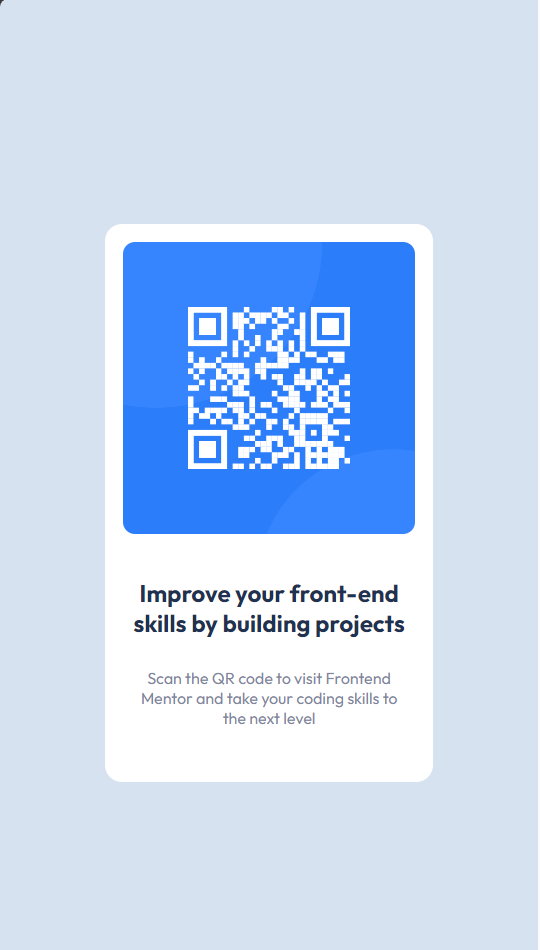

# Frontend Mentor - QR code component solution

This is a solution to the [QR code component challenge on Frontend Mentor](https://www.frontendmentor.io/challenges/qr-code-component-iux_sIO_H). Frontend Mentor challenges help you improve your coding skills by building realistic projects. 

## Table of contents

- [Overview](#overview)
  - [Screenshot](#screenshot)
  - [Links](#links)
- [My process](#my-process)
  - [Built with](#built-with)
  - [What I learned](#what-i-learned)
  - [Continued development](#continued-development)
  - [Useful resources](#useful-resources)
- [Author](#author)
- [Acknowledgments](#acknowledgments)


## Overview
This is my first attempt to learn how to do a front-end development of a particular website. in this case, I've learnt how to design a QR Code Component By using an HTML and CSS. 

### Screenshot

![]


### Links

- Solution URL: [Add solution URL here](https://your-solution-url.com)
- Live Site URL: [Add live site URL here](https://your-live-site-url.com)

## My process
it all start with coding the HTML itself. for me , the HTML is just like a skeleton for a website. so with that kind of understanding, i'm able to code the structure needed for the website. in the HTML code, i've start to code from a container all step-by step to a text segment, which gives the information of the QR code itself. after finished code the HTML, i went to code the CSS. The CSS itself is like a "skin" for the website, where i can adjust the appearance of the website that i'm designing to have a style, a color, that i want.

### Built with

- Semantic HTML5 markup
- CSS custom properties


### What I learned

With this challenge, I've learned, increased, and reinforced my knowledge on how to create a web interface out of HTML and CSS. The challenge also helped me to sharpen my knowledge about how can i adjust the position of an object in web-interface such a qr code on a website in this case. Other than that, here is some code snippets from my project:


```html
<div class="container">
    <div class="card">
      
      <div class="text">
        <h2> Improve your front-end skills by building projects</h2>
        <p> Scan the QR code to visit Frontend Mentor and take your coding skills to the next level</p>
      </div>
    </div>
  </div>
```
```css
.{
    margin: 0;
    padding: 0;
}
body{
    font-family: "Outfit", sans-serif;
    background-color:  hsl(212, 45%, 89%);
    min-height: 100vh;
    display: flex;
    align-items: center;
    font-size: 15 px;
}

.container{
    max-width: 360px;
    margin: 0 auto;
}

.card {
    background-color: hsl(0, 0%, 100%);
    padding: 18px ;
    border-radius: 17px;
    text-align: center;
    margin: 0 1em;
}

.card img{
    width: 100%;
    border-radius: 12px;
}


### Continued development

With the knowledge I've got from this challenge, I've planned myself to go further from this. In the future project, I will learn more about creating a basic to-do list tracker website using HTML and CSS. also , maybe I want to add some .JS functionality to make it more sleek and interactive with the user.


### Useful resources

- [Example resource 1](https://www.example.com) - This helped me for XYZ reason. I really liked this pattern and will use it going forward.
- [Example resource 2](https://www.example.com) - This is an amazing article which helped me finally understand XYZ. I'd recommend it to anyone still learning this concept.


## Author

- Frontend Mentor - [@@xie-projects](https://www.frontendmentor.io/profile/xie-projects)
- Twitter - [@yourusername](https://www.twitter.com/andrewj77220825)


# QR-Code-Component-Using-HTML-and-CSS

